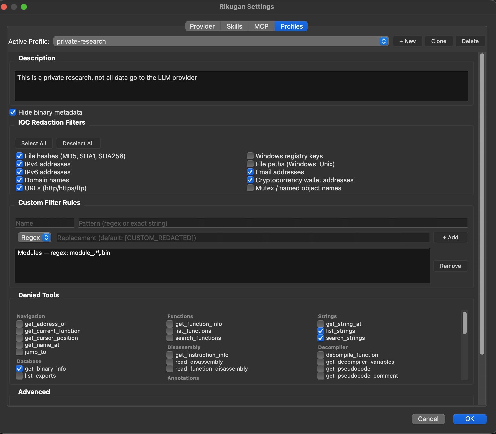

# Rikugan (六眼)

A reverse-engineering agent for **IDA Pro** and **Binary Ninja** that integrates a multi-provider LLM directly into your analysis UI. This project was vibecoded together with my friend, Claude Code.


[Documentation](https://rikugan.reversing.codes/docs.html) | [Architecture](https://rikugan.reversing.codes/ARCHITECTURE.html) | [Issues](https://github.com/buzzer-re/Rikugan/issues)

## Install

Auto-detects IDA Pro, Binary Ninja, or both.

**Linux / macOS:**
```bash
curl -fsSL https://raw.githubusercontent.com/buzzer-re/Rikugan/main/install.sh | bash
```

**Windows (PowerShell):**
```powershell
irm https://raw.githubusercontent.com/buzzer-re/Rikugan/main/install.ps1 | iex
```

For host-specific install, manual setup, and configuration, see the [docs](https://rikugan.reversing.codes/docs.html).

## Is this another MCP client?

No, Rikugan is an ***agent*** built to live inside your RE host. It does not consume an MCP server to interact with the host database; it has its own agentic loop, context management, role prompt ([source](rikugan/agent/system_prompt.py)), and an in-process tool orchestration layer.

The agent loop is a generator-based turn cycle: each user message kicks off a stream→execute→repeat pipeline where the LLM response is streamed token-by-token and tool calls are intercepted and dispatched. It supports automatic error recovery, mid-run user questions, plan mode for multi-step workflows, and message queuing — all without leaving the disassembler.

The agent really ***lives*** and ***breathes*** reversing.

- No need to switch to an external MCP client
- Assistant-first, not designed to do your job (unless you ask it to)
- Extensible to many LLM providers and local installations (Ollama)
- Quick to enable — just hit Ctrl+Shift+I and the chat will appear

## Features

**60+ tools** covering navigation, decompiler, disassembly, cross-references, strings, annotations, types, scripting, and host-specific IL/microcode manipulation. The agent always asks permission before running scripts and will never execute the target binary. Full tool reference in the [docs](https://rikugan.reversing.codes/docs.html).

**Exploration** — Inspired by how code agents work, but applied to binaries. The orchestrator maps the binary (imports, exports, strings, key functions), then spawns isolated subagents to analyze in parallel. Each reports back, and the orchestrator synthesizes a complete picture.

||
|:--:|
|Orchestrator spawning subagents in parallel|

**Natural Language Patches** (Experimental) — `/modify` lets you describe what you want changed in plain English. Rikugan explores the binary, builds context, and applies the patches.

||
|:--:|
|`/modify make this maze game easy, let me pass through walls`|

**Deobfuscation** (Experimental, Binary Ninja) — The `/deobfuscation` skill activates plan mode to recognize and remove control flow flattening, opaque predicates, MBA expressions, and junk code using IL read/write primitives.

||
|:--:|
|~3x speed of the workflow, original process took ~4:30 min|

**Memory** — Findings are saved to `RIKUGAN.md` next to your database, persisting across sessions.

**Skills & MCP** — 12 built-in skills, custom skill support, and MCP server integration. Reuse skills and MCP servers from Claude Code and Codex.

### Profiles

Profiles let you customize the agent to fit your analysis needs. They give you granular control over which data the LLM can read, restrict which tools it can use, and let you define custom rules to filter data.



## Recommended Providers

| Provider | Notes |
|----------|-------|
| **Claude Opus 4.6** | Best overall. Recommend Claude Pro/Max plan with OAuth over API. |
| **Claude Sonnet 4.6** | Strong at lower cost. Both Anthropic models use prompt caching. |
| **MiniMax M2.5 / Highspeed** | On par with Opus in local tests. Generous limits, low cost. |
| **Gemini 2.5 / 3 / 3.1 Pro** | Solid results. Hallucinates more than Anthropic/MiniMax. |
| **Kimi 2.5** | Strong coding, but lacks rigor for complex RE tasks. |
| **LLAMA 70B / GPT 120B OSS** | Interesting but not production-ready for RE. |

Also supports any OpenAI-compatible endpoint and Ollama for local models.

## Requirements

- IDA Pro 9.0+ with Hex-Rays decompiler or Binary Ninja (UI mode)
- Python 3.10+
- At least one LLM provider
- Windows, macOS, or Linux

> **IDA Pro + Python >= 3.14:** Shiboken has a known UAF bug. Rikugan includes a workaround, but Python 3.10 is still the safest choice. See the [upstream report](https://community.hex-rays.com/t/ida-9-3-b1-macos-arm64-uaf-crash/646).

## Conclusion

If you'd asked me last year what I thought about AI doing reverse engineering, I'd probably have said something like "Nah, impossible — it hallucinates, and reverse engineering is not something as simple as writing code." But this year I completely changed my mind when I saw what was achievable. AI is not the ChatGPT from 2023 anymore; it's something entirely different.

For that reason, I decided to invest this year in researching this topic. It's amazing what we can build with agentic coding — it's surreal how quickly I'm learning topics that I simply "didn't have time" to study before.

Rikugan is just one of many projects I've built in the last three months. The first version was built in a single night. Within two days it already supported both IDA and Binary Ninja. Within three days, it was essentially what you see here, with only minor tweaks since.

This is a work in progress with many areas for improvement. I took care to ensure this wouldn't be another AI slop project, but I'm certain there is still room to grow. I hope you use it for good. If you find bugs, have suggestions, or want quality-of-life improvements, please open an issue.

That's all — thanks.
